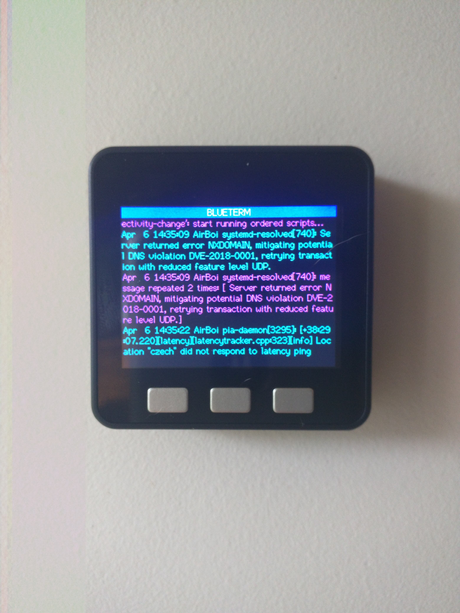
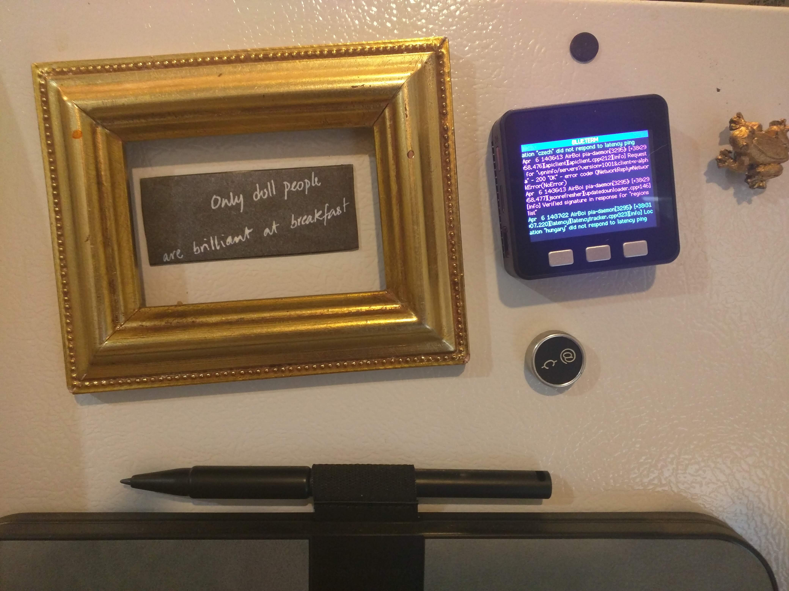

# M5 BLUETERM
M5 Core Bluetooth to TFT display terminal. This sketch makes your M5 Core into a remote bluetooth terminal.

Currently using the TFT_eSPI library directly as M5.Lcd scrolling is broken. Code framework nearly entirely from https://github.com/Bodmer/TFT_eSPI/tree/master/examples/320%20x%20240/TFT_Terminal. Will be altering code in this STABLE branch for more functionality. UNSTABLR M5stack branch is for work on integrating into M5Stack.

You need to define the driver to use with TFT_eSPI first:
```
s@AirBoi:~$ cd Arduino/libraries/
s@AirBoi:~/Arduino/libraries$ cd TFT_eSPI/
s@AirBoi:~/Arduino/libraries/TFT_eSPI$ vim User_Setup_Select.h 
Find and UNCOMMENT: //#include <User_Setups/Setup1_ILI9341.h>  // Setup file configured for my ILI9341
```

Linux Example:
```
$ sudo bluetoothctl
[bluetooth]# agent on
[bluetooth]# scan on
  [NEW] Device 08:3E:8E:E6:79:47 annapurna
  [NEW] Device 00:25:56:D1:36:6B ubuntu-0
  ....
  [NEW] Device <bluetooth address> BLUETERM
[bluetooth]# pair <bluetooth address>
[bluetooth]# trust <bluetooth address>
CTRL-D
$ sudo rfcomm connect /dev/rfcomm0 <bluetooth address> 1
$ tail -f /var/log/syslog > /dev/rfcomm0
```



